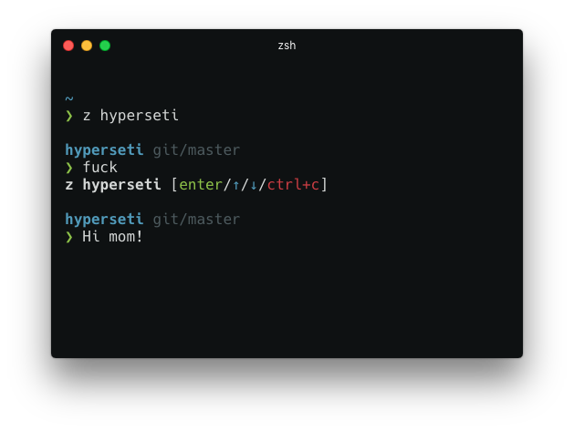

# Seti for Hyperterm

[HyperTerm](https://github.com/zeit/hyperterm) theme based on the [Atom Seti theme](https://github.com/jesseweed/seti-ui).



### Install
1. Open HyperTerm's preferences with `Cmd+,` (or manually at `~/.hyperterm.js`) with your editor.
2. Update your list of plugins to include `hyperseti`, like so:

  ```js
plugins: [
  'hyperseti'
],
```
3. Fully reload HyperTerm (`Cmd+Shift+R), and tada!

### License
MIT
